[TOC]


# 深度学习

> 课程地址：[https://mooc.study.163.com/smartSpec/detail/1001319001.htm](https://mooc.study.163.com/smartSpec/detail/1001319001.htm)
>
> 课后作业1：[https://blog.csdn.net/u013733326/article/details/79827273](https://blog.csdn.net/u013733326/article/details/79827273) 
>
> 课后作业2：[https://blog.csdn.net/koala_tree/category_7186915.html](https://blog.csdn.net/koala_tree/category_7186915.html)
>
> GitHub参考笔记：[https://github.com/Kulbear/deep-learning-coursera](https://github.com/Kulbear/deep-learning-coursera)
>
> 课程笔记1：[https://kyonhuang.top/Andrew-Ng-Deep-Learning-notes/#/](https://kyonhuang.top/Andrew-Ng-Deep-Learning-notes/#/)
>
> 课程笔记2：[https://github.com/fengdu78/deeplearning_ai_books](https://github.com/fengdu78/deeplearning_ai_books)

## 一、神经网络和深度学习

### 神经网络基础

#### 逻辑回归（Logistics Regression）

Logistic 回归是一个用于二分分类的算法。

Logistic 回归中使用的参数如下：

- 输入的特征向量：$x \in R^{n_{x}}$，其中 ${n_{x}}$是特征数量；
- 用于训练的标签：y∈0,1y∈0,1
- 权重：$w \in R^{n_{x}}$
- 偏置： $b \in R$
- 输出：$\hat{y}=\sigma\left(w^{T} x+b\right)$

激活函数：

- sigmoid函数

  $$s=\sigma\left(w^{T} x+b\right)=\sigma(z)=\frac{1}{1+e^{-z}}$$

- tanh函数

- ReLU函数

- 带泄露的ReLU函数

损失函数：

**损失函数（loss function）**用于衡量预测结果与真实值之间的误差。损失函数是在单个训练样本中定义的，它衡量了在**单个**训练样本上的表现。

一般使用：$$L(\hat{y}, y)=-(y \log \hat{y})-(1-y) \log (1-\hat{y})$$

成本函数：

**代价函数（cost function，或者称作成本函数）**衡量的是在**全体**训练样本上的表现，即衡量参数 w 和 b 的效果。

$$J(w, b)=\frac{1}{m} \sum_{i=1}^{m} L\left(\hat{y}^{(i)}, y^{(i)}\right)$$

#### 梯度下降法（Gradient Descent）

函数的**梯度（gradient）**指出了函数的最陡增长方向。即是说，按梯度的方向走，函数增长得就越快。那么按梯度的负方向走，函数值自然就降低得最快了。

模型的训练目标即是寻找合适的 w 与 b 以最小化代价函数值。

参数 w 的更新公式为：$$w:=w-\alpha \frac{d J(w, b)}{d w}$$

其中 α 表示学习速率，即每次更新的 w 的步伐长度。

当 w 大于最优解 w′ 时，导数大于 0，那么 w 就会向更小的方向更新。反之当 w 小于最优解 w′ 时，导数小于 0，那么 w 就会向更大的方向更新。迭代直到收敛。

在成本函数 J(w, b) 中还存在参数 b，因此也有：$$b:=b-\alpha \frac{d J(w, b)}{d b}$$

#### 逻辑回归中的梯度下降（Logistic Regression Gradient Descent）

假设输入的特征向量维度为 2，即输入参数共有 x1, w1, x2, w2, b 这五个。可以推导出如下的计算图：

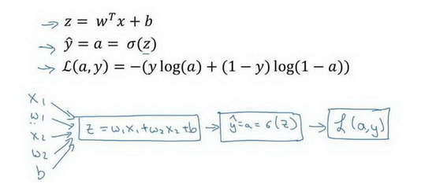

首先反向求出 L 对于 a 的导数：

$$d a=\frac{d L(a, y)}{d a}=-\frac{y}{a}+\frac{1-y}{1-a}$$

然后继续反向求出 L 对于 z 的导数：

$$d z=\frac{d L}{d z}=\frac{d L(a, y)}{d z}=\frac{d L}{d a} \frac{d a}{d z}=a-y$$

然后是：

$$\frac{\partial L}{\partial w_{1}}=d w_{1}=x_{1} \cdot d z$$

$$\frac{\partial L}{\partial w_{2}}=d w_{2}=x_{2} \cdot d z$$

根据如下公式进行参数更新：

$$\begin{aligned}
w_{1} &:=w_{1}-\alpha d w_{1} \\
w_{2} &:=w_{2}-\alpha d w_{2} \\
b &:=b-\alpha d b
\end{aligned}$$

接下来我们需要将对于单个用例的损失函数扩展到整个训练集的代价函数：

$$\begin{array}{c}
J(w, b)=\frac{1}{m} \sum_{i=1}^{m} L\left(a^{(i)}, y^{(i)}\right) \\
a^{(i)}=\hat{y}^{(i)}=\sigma\left(z^{(i)}\right)=\sigma\left(w^{T} x^{(i)}+b\right)
\end{array}$$

我们可以对于某个权重参数 w1，其导数计算为：

$$\frac{\partial J(w, b)}{\partial w_{1}}=\frac{1}{m} \sum_{i=1}^{m} \frac{\partial L\left(a^{(i)}, y^{(i)}\right)}{\partial w_{1}}$$

代码流程：

```python
J=0;dw1=0;dw2=0;db=0;
for i = 1 to m
    z(i) = wx(i)+b;
    a(i) = sigmoid(z(i));
    J += -[y(i)log(a(i))+(1-y(i)）log(1-a(i));
    dz(i) = a(i)-y(i);
    dw1 += x1(i)dz(i);
    dw2 += x2(i)dz(i);
    db += dz(i);
J/= m;
dw1/= m;
dw2/= m;
db/= m;
w=w-alpha*dw
b=b-alpha*db
```

上述过程在计算时有一个缺点：你需要编写两个 for 循环。第一个 for 循环遍历 m 个样本，而第二个 for 循环遍历所有特征。如果有大量特征，在代码中显式使用 for 循环会使算法很低效。**向量化**可以用于解决显式使用 for 循环的问题。

#### 向量化(Vectorization)

不用显式 for 循环，实现 Logistic 回归的梯度下降一次迭代（对应之前蓝色代码的 for 循环部分。这里公式和 NumPy 的代码混杂，注意分辨）：

$$\begin{array}{c}
Z=w^{T} X+b=n p . d o t(w . T, x)+b \\
A=\sigma(Z) \\
d Z=A-Y \\
d w=\frac{1}{m} X d Z^{T} \\
d b=\frac{1}{m} n p . s u m(d Z) \\
w:=w-\sigma d w \\
b:=b-\sigma d b
\end{array}$$

### 浅层神经网络

#### 神经网络的表示

#### 激活函数

- sigmoid函数：

  $$a=\frac{1}{1+e^{-z}}$$

  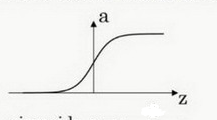

  

- tanh 函数（the hyperbolic tangent function，双曲正切函数）：

  $$a=\frac{e^{z}-e^{-z}}{e^{z}+e^{-z}}$$

  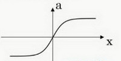

  > 效果几乎总比 sigmoid 函数好（除开**二元分类的输出层**，因为我们希望输出的结果介于 0 到 1 之间），因为函数输出介于 -1 和 1 之间，激活函数的平均值就更接近 0，有类似数据中心化的效果。
  >
  > 然而，tanh 函数存在和 sigmoid 函数一样的缺点：当 z 趋紧无穷大（或无穷小），导数的梯度（即函数的斜率）就趋紧于 0，这使得梯度算法的速度大大减缓。

- **ReLU 函数（the rectified linear unit，修正线性单元）**：

  $$a=\max (0, z)$$

  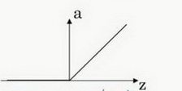

  > 当 z > 0 时，梯度始终为 1，从而提高神经网络基于梯度算法的运算速度，收敛速度远大于 sigmoid 和 tanh。然而当 z < 0 时，梯度一直为 0，但是实际的运用中，该缺陷的影响不是很大。

- Leaky ReLU（带泄漏的 ReLU）：

  $$a=\max (0.01 z, z)$$

  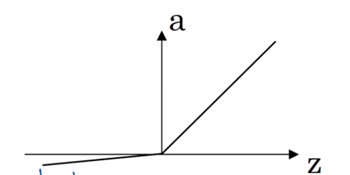

  > Leaky ReLU 保证在 z < 0 的时候，梯度仍然不为 0。理论上来说，Leaky ReLU 有 ReLU 的所有优点，但在实际操作中没有证明总是好于 ReLU，因此不常用。

#### 神经网络的梯度下降

- 正向传播

$$\begin{array}{c}
Z^{[1]}=\left(W^{[1]}\right)^{T} X+b^{[1]} \\
A^{[1]}=g^{[1]}\left(Z^{[1]}\right) \\
Z^{[2]}=\left(W^{[2]}\right)^{T} A^{[1]}+b^{[2]} \\
A^{[2]}=g^{[2]}\left(Z^{[2]}\right)=\sigma\left(Z^{[2]}\right)
\end{array}$$

- 反向传播

$$d z^{[2]}=A^{[2]}-Y, Y=\left[y^{[1]} \quad y^{[2]} \quad \cdots \quad y^{[m]}\right]$$

$$d W^{[2]}=\frac{1}{m} d z^{[2]} A^{[1] T}$$

$$\mathrm{d} b^{[2]}=\frac{1}{m} n p . \operatorname{sum}\left(d z^{[2]}, \text {axis}=1, \text { keepdims }=\text {True}\right)$$

$$d z^{[1]}=\underbrace{W^{[2] T} \mathrm{d} z^{[2]}}_{\left(n^{[1]}, m\right)} * \underbrace{g^{[1]}{'}}_{\text {activation function of hidden layer}} * \underbrace{\left(z^{[1]}\right)}_{\left(n^{[1]}, m\right)}$$

$$d W^{[1]}=\frac{1}{m} d z^{[1]} x^{T}$$

$$\underbrace{d b^{[1]}}_{\left(n^{[1]}, 1\right)}=\frac{1}{m} n p . \operatorname{sum}\left(d z^{[1]}, \text {axis}=1, \text { keepdims }=\text {True}\right)$$

#### 随机初始化

> 如果在初始时将两个隐藏神经元的参数设置为相同的大小，那么两个隐藏神经元对输出单元的影响也是相同的，通过反向梯度下降去进行计算的时候，会得到同样的梯度大小，所以在经过多次迭代后，两个隐藏层单位仍然是对称的。无论设置多少个隐藏单元，其最终的影响都是相同的，那么多个隐藏神经元就没有了意义。
>
> 在初始化的时候，W 参数要进行随机初始化，不可以设置为 0。而 b 因为不存在对称性的问题，可以设置为 0。

$$\begin{array}{l}
W^{[1]}=n p . \text {random.randn}(2,2) * 0.01, b^{[1]}=n p . \text {zeros}((2,1)) \\
W^{[2]}=n p . \text { random.randn}(2,2) * 0.01, b^{[2]}=0
\end{array}$$

> 这里将 W 的值乘以 0.01（或者其他的常数值）的原因是为了使得权重 W 初始化为较小的值，这是因为使用 sigmoid 函数或者 tanh 函数作为激活函数时，W 比较小，则 Z=WX+b 所得的值趋近于 0，梯度较大，能够提高算法的更新速度。而如果 W 设置的太大的话，得到的梯度较小，训练过程因此会变得很慢。
>
> ReLU 和 Leaky ReLU 作为激活函数时不存在这种问题，因为在大于 0 的时候，梯度均为 1。

### 深层神经网络

#### 正向传播

- **输入**：$$a^{[l-1]}$$
- **输出**：$$a^{[l]}, \quad \operatorname{cache}\left(z^{[l]}\right)$$
- **公式**：$$\begin{array}{c}
  z^{[l]}=w^{[l]} \cdot a^{[l-1]}+b^{[l]} \\
  a^{|l|}=g^{[l]}\left(z^{[l]}\right)
  \end{array}$$
- **向量化公式**：$$\begin{array}{c}
  Z^{[l]}=W^{[l]} \cdot A^{[l-1]}+b^{[l]} \\
  A^{|l|}=g^{[l]}\left(Z^{[l]}\right)
  \end{array}$$

#### 反向传播

- **输入**：$$d a^{[l]}$$
- **输出**：$$d a^{[l-1]}, d W^{[l]}, d b^{[l]}$$
- **公式**：$$\begin{array}{c}
  d Z^{[l]}=d a^{[l]} * g^{[l]^{\prime}}\left(Z^{[l]}\right) \\
  d W^{[l]}=d Z^{[l]} \cdot a^{[l-1]} \\
  d b^{|l|}=d Z^{|l|} \\
  d a^{[l-1]}=W^{|l| T} \cdot d Z^{[l]}
  \end{array}$$
- **向量化公式**：$$d Z^{[l]}=d A^{[l]} * g^{[l]^{\prime}}\left(Z^{[l]}\right)\\
  d W^{[\rceil]}=\frac{1}{m} d Z^{[l]} \cdot A^{[l-1] T}\\
  d b^{[l]}=\frac{1}{m} np. sum\left(d z^{[l]}, \text {axis}=1, \text { keepdims }=\text {True}\right)\\
  d A^{[l-1]}=W^{[l] T} \cdot d Z^{[l]}$$

#### 超参数

**参数**即是我们在过程中想要模型学习到的信息（**模型自己能计算出来的**），例如 $W^{[l]}$，$b^{[l]}$。而**超参数（hyper parameters）**即为控制参数的输出值的一些网络信息（**需要人经验判断**）。超参数的改变会导致最终得到的参数 $W^{[l]}$，$b^{[l]}$的改变。

典型的超参数有：

- 学习速率：α
- 迭代次数：N
- 隐藏层的层数：L
- 每一层的神经元个数：$n^{[1]}$，$n^{[2]}$，...
- 激活函数 g(z) 的选择

当开发新应用时，预先很难准确知道超参数的最优值应该是什么。因此，通常需要尝试很多不同的值。应用深度学习领域是一个很大程度基于经验的过程。

## 二、改善深层神经网络：超参数调试、正则化以及优化

### 正则化（Regularization）

**正则化**是在成本函数中加入一个正则化项，避免过度拟合，减少网络误差。正则化可以用于解决高方差的问题。

#### Logistic 回归中的正则化

对于 Logistic 回归，加入 L2 正则化（也称“L2 范数”）的成本函数：

$$J(w, b)=\frac{1}{m} \sum_{i=1}^{m} L\left(\hat{y}^{(i)}, y^{(i)}\right)+\frac{\lambda}{2 m}\|w\|_{2}^{2}$$

- L2正则化：$$\frac{\lambda}{2 m}\|w\|_{2}^{2}=\frac{\lambda}{2 m} \sum_{j=1}^{n_{x}} w_{j}^{2}=\frac{\lambda}{2 m} w^{T} w$$
- L1正则化：$$\frac{\lambda}{2 m}\|w\|_{1}=\frac{\lambda}{2 m} \sum_{j=1}^{n_{x}}\left|w_{j}\right|$$

其中，λ 为**正则化因子**，是**超参数**。

由于 L1 正则化最后得到 w 向量中将存在大量的 0，使模型变得稀疏化，因此 L2 正则化更加常用。

**注意**，`lambda`在 Python 中属于保留字，所以在编程的时候，用`lambd`代替这里的正则化因子。

#### 神经网络中的正则化

对于神经网络，加入正则化的成本函数：

$$J\left(w^{[1]}, b^{[1]}, \ldots, w^{[L]}, b^{[L]}\right)=\frac{1}{m} \sum_{i=1}^{m} L\left(\hat{y}^{(i)}, y^{(i)}\right)+\frac{\lambda}{2 m} \sum_{l=1}^{L}\left\|w^{[l]}\right\|_{F}^{2}$$

因为 w 的大小为$$\left(n^{[l-1]}, n^{[l]}\right)$$，因此$$\left\|w^{[l]}\right\|_{F}^{2}=\sum_{i=1}^{n^{[l-1]}} \sum_{j=1}^{n^{[l]}}\left(w_{i j}^{[l]}\right)^{2}$$

该矩阵范数被称为**弗罗贝尼乌斯范数（Frobenius Norm）**，所以神经网络中的正则化项被称为弗罗贝尼乌斯范数矩阵。

#### 权重衰减（Weight decay）

**在加入正则化项后，梯度变为**（反向传播要按这个计算）：

$$d W^{[l]}=\frac{\partial L}{\partial w^{[l]}}+\frac{\lambda}{m} W^{[l]}$$

代入梯度更新公式：

$$W^{[l]}:=W^{[l]}-\alpha d W^{[l]}$$

可得：

$$\begin{array}{c}
W^{[l]}:=W^{[l]}-\alpha\left[\frac{\partial L}{\partial w^{[l]}}+\frac{\lambda}{m} W^{[l]}\right] \\
=W^{[l]}-\alpha \frac{\lambda}{m} W^{[l]}-\alpha \frac{\partial L}{\partial w^{[l]}} \\
=\left(1-\frac{\alpha \lambda}{m}\right) W^{[l]}-\alpha \frac{\partial L}{\partial w^{[l]}}
\end{array}$$

其中，因为$$1-\frac{\alpha \lambda}{m}<1$$，会给原来的$W^{[l]}$一个衰减的参数，因此 L2 正则化项也被称为**权重衰减（Weight Decay）**。

#### 正则化可以减小过拟合的原因

- 直观解释

正则化因子设置的足够大的情况下，为了使成本函数最小化，权重矩阵 W 就会被设置为接近于 0 的值，**直观上**相当于消除了很多神经元的影响，那么大的神经网络就会变成一个较小的网络。当然，实际上隐藏层的神经元依然存在，但是其影响减弱了，便不会导致过拟合。

- 数学解释

假设神经元中使用的激活函数为`g(z) = tanh(z)`（sigmoid 同理）。

在加入正则化项后，当 λ 增大，导致$W^{[l]}$减小，$$Z^{[l]}=W^{[l]} a^{[l-1]}+b^{[l]}$$便会减小。由上图可知，在 z 较小（接近于 0）的区域里，`tanh(z)`函数近似线性，所以每层的函数就近似线性函数，整个网络就成为一个简单的近似线性的网络，因此不会发生过拟合。

- 其他解释

在权值 $W^{[l]}$变小之下，输入样本 X 随机的变化不会对神经网络模造成过大的影响，神经网络受局部噪音的影响的可能性变小。这就是正则化能够降低模型方差的原因。

### Dropout 正则化

**dropout（随机失活）**是在神经网络的隐藏层为每个神经元结点设置一个随机消除的概率，保留下来的神经元形成一个结点较少、规模较小的网络用于训练。dropout 正则化较多地被使用在**计算机视觉（Computer Vision）**领域。

**反向随机失活（inverted dropout）**是实现 dropout 的方法。对第`l`层进行 dropout：

```python
keep_prob = 0.8    # 设置神经元保留概率
dl = np.random.rand(al.shape[0], al.shape[1]) < keep_prob
al = np.multiply(al, dl)
al /= keep_prob
```

最后一步`al /= keep_prob`是因为 $a^{[l]}$中的一部分元素失活（相当于被归零），为了在下一层计算时不影响 $$Z^{[l+1]}=W^{[l]} a^{[l]}+b^{[l+1]}$$的期望值，因此除以一个`keep_prob`。

**注意**，在**测试阶段不要使用 dropout**，因为那样会使得预测结果变得随机。

#### 理解Dropout

对于单个神经元，其工作是接收输入并产生一些有意义的输出。但是加入了 dropout 后，输入的特征都存在被随机清除的可能，所以该神经元不会再特别依赖于任何一个输入特征，即不会给任何一个输入特征设置太大的权重。

因此，通过传播过程，dropout 将产生和 L2 正则化相同的**收缩权重**的效果。

对于不同的层，设置的`keep_prob`也不同。一般来说，神经元较少的层，会设`keep_prob`为 1.0，而神经元多的层则会设置比较小的`keep_prob`。

dropout 的一大**缺点**是成本函数无法被明确定义。因为每次迭代都会随机消除一些神经元结点的影响，因此无法确保成本函数单调递减。因此，使用 dropout 时，先将`keep_prob`全部设置为 1.0 后运行代码，确保 J(w,b)J(w,b)函数单调递减，再打开 dropout。

### 归一化输入（Normalizing inputs）

训练神经网络，其中一个加速训练的方法就是归一化输入。假设一个训练集有两个特征，输入特征为2维，归一化需要两个步骤：

1. 零均值

2. 归一化方差；

   我们希望无论是训练集和测试集都是通过相同的和定义的数据转换，这两个是由训练集得出来的。

#### 归一化公式

$$\begin{array}{c}
\mu=\frac{1}{m} \sum_{i=1}^{m} x^{(i)} \\
\sigma^2=\frac{1}{m} \sum_{i=1}^{m} x^{(i)^{2}}
\end{array}\\x=\frac{x-\mu}{\sigma^2}$$

### 梯度消失/梯度爆炸（Vanishing / Exploding gradients）

在梯度函数上出现的以指数级递增或者递减的情况分别称为**梯度爆炸**或者**梯度消失**。

#### 利用初始化缓解梯度消失和爆炸

根据$$z=w_1x_1+w_2x_2+...+w_nx_n+b$$可知，当输入的数量 n 较大时，我们希望每个 wi 的值都小一些，这样它们的和得到的 z 也较小。

$$w^{[l]}=np.random.randn(shape)*np.sqrt(\frac{1}{n^{[l-1]}})$$

### 梯度检验（Gradient checking）

双边误差求导（即导数的定义）

$$f^{\prime}(\theta)=\lim _{\varepsilon \rightarrow 0}=\frac{f(\theta+\varepsilon)-(\theta-\varepsilon)}{2 \varepsilon}$$

求得一个梯度逼近值

$$d \theta_{\text {approx}}[i]=\frac{J\left(\theta_{1}, \theta_{2}, \ldots, \theta_{i}+\varepsilon, \ldots\right)-J\left(\theta_{1}, \theta_{2}, \ldots, \theta_{i}-\varepsilon, \ldots\right)}{2 \varepsilon}$$

$$\approx d \theta[i]=\frac{\partial J}{\partial \theta_{i}}$$

我们用梯度检验值$$\frac{\left\|d \theta_{\text {approx}}-d \theta\right\|_{2}}{\left\|d \theta_{\text {approx}}\right\|_{2}+\|d \theta\|_{2}}$$其中$$\|x\|_{2}=\sum_{i=1}^{N}\left|x_{i}\right|^{2}$$表示向量 x 的 2-范数（也称“欧几里德范数”）。

如果梯度检验值和 ε 的值相近，说明神经网络的实施是正确的，否则要去检查代码是否存在 bug。

#### 在神经网络实施梯度检验的实用技巧和注意事项

1. 不要在训练中使用梯度检验，它只用于调试（debug）。使用完毕关闭梯度检验的功能；
2. 如果算法的梯度检验失败，要检查所有项，并试着找出 bug，即确定哪个 dθapprox[i] 与 dθ 的值相差比较大；
3. 当成本函数包含正则项时，也需要带上正则项进行检验；
4. 梯度检验不能与 dropout 同时使用。因为每次迭代过程中，dropout 会随机消除隐藏层单元的不同子集，难以计算 dropout 在梯度下降上的成本函数 J。建议关闭 dropout，用梯度检验进行双重检查，确定在没有 dropout 的情况下算法正确，然后打开 dropout；

### 优化算法

#### Mini-batch 梯度下降

**Mini-Batch 梯度下降法**（小批量梯度下降法）每次同时处理单个的 mini-batch，其他与 batch 梯度下降法一致。

使用 batch 梯度下降法，对整个训练集的一次遍历只能做一个梯度下降；而使用 Mini-Batch 梯度下降法，对整个训练集的一次遍历（称为一个 epoch）能做 mini-batch 个数个梯度下降。之后，可以一直遍历训练集，直到最后收敛到一个合适的精度。

#### 获得 mini-batch 的步骤

1. 将数据集打乱；
2. 按照既定的大小分割数据集；

其中打乱数据集的代码：

```python
m = X.shape[1] 
permutation = list(np.random.permutation(m))
shuffled_X = X[:, permutation]
shuffled_Y = Y[:, permutation].reshape((1,m))
```

`np.random.permutation`与`np.random.shuffle`有两处不同：

1. 如果传给`permutation`一个矩阵，它会返回一个洗牌后的矩阵副本；而`shuffle`只是对一个矩阵进行洗牌，没有返回值。
2. 如果传入一个整数，它会返回一个洗牌后的`arange`。

#### 指数加权平均数

**指数加权平均（Exponentially Weight Average）**是一种常用的序列数据处理方式，计算公式为：

$$S_{t}=\left\{\begin{array}{ll}
Y_{1}, & t=1 \\
\beta S_{t-1}+(1-\beta) Y_{t}, & t>1
\end{array}\right.$$

其中 Y<sub>t</sub> 为 t 下的实际值，S<sub>t</sub> 为 t 下加权平均后的值，β 为权重值。

指数加权平均数在统计学中被称为“指数加权移动平均值”。

### 动量梯度下降法

**动量梯度下降（Gradient Descent with Momentum）**是计算梯度的指数加权平均数，并利用该值来更新参数值。具体过程为：

for l = 1, .. , L：

​	$$\begin{array}{c}
v_{{d W}^{[l]}}=\beta v_{{d W} ^{[l]}}+(1-\beta) d W^{[l]} \\
v_{d b^{[l]}}=\beta v_{d b^{[l]}}+(1-\beta) d b^{[l]} \\
W^{[l]}:=W^{[l]}-\alpha v_{d W^{[l]}} \\
b^{[l]}:=b^{[l]}-\alpha v_{d b^{\mid l]}}
\end{array}$$

其中，将动量衰减参数 β 设置为 **0.9** 是超参数的一个常见且效果不错的选择。当 β 被设置为 0 时，显然就成了 batch 梯度下降法。

### RMSprop

**RMSProp（Root Mean Square Propagation，均方根传播）**算法是在对梯度进行指数加权平均的基础上，引入平方和平方根。具体过程为（省略了 l）：

$$\begin{aligned}
s_{d w} &=\beta s_{d w}+(1-\beta)(d w)^{2} \\
s_{d b} &=\beta s_{d b}+(1-\beta)(d b)^{2} \\
w &:=w-\alpha \frac{d w}{\sqrt{s_{d w}+\epsilon}} \\
b &:=b-\alpha \frac{d b}{\sqrt{s_{d b}+\epsilon}}
\end{aligned}$$

其中，ϵ 是一个实际操作时加上的较小数（例如10^-8），为了防止分母太小而导致的数值不稳定。

RMSProp 有助于减少抵达最小值路径上的摆动，并允许使用一个更大的学习率 α，从而加快算法学习速度。并且，它和 Adam 优化算法已被证明适用于不同的深度学习网络结构。

注意，β 也是一个超参数。

### Adam 优化算法

**Adam 优化算法（Adaptive Moment Estimation，自适应矩估计）**基本上就是将 Momentum 和 RMSProp 算法结合在一起，通常有超越二者单独时的效果。具体过程如下（省略了 l）：

首先进行初始化：

$$v_{dW}=0,s_{dW}=0,v_{db}=0,s_{db}=0,v_{dW}=0,s_{dW}=0,v_{db}=0,s_{db}=0$$

用每一个 mini-batch 计算 dW、db，第 t 次迭代时：

$$\begin{aligned}
v_{d W} &=\beta_{1} v_{d W}+\left(1-\beta_{1}\right) d W \\
v_{d b} &=\beta_{1} v_{d b}+\left(1-\beta_{1}\right) d b \\
s_{d W} &=\beta_{2} s_{d W}+\left(1-\beta_{2}\right)(d W)^{2} \\
s_{d b} &=\beta_{2} s_{d b}+\left(1-\beta_{2}\right)(d b)^{2}
\end{aligned}$$

一般使用 Adam 算法时需要计算偏差修正：

$$\begin{aligned}
v_{d W}^{\text {corrected}} &=\frac{v_{d W}}{1-\beta_{1}^{t}} \\
v_{d b}^{\text {corrected}} &=\frac{v_{d b}}{1-\beta_{1}^{t}} \\
s_{d W}^{\text {corrected}} &=\frac{s_{d W}}{1-\beta_{2}^{t}} \\
s_{d b}^{\text {corrected}} &=\frac{s_{d b}}{1-\beta_{2}^{t}}
\end{aligned}$$

所以，更新 W、b 时有：

$$\begin{array}{c}
W:=W-\alpha \frac{v_{d W}^{\text {corrected}}}{\sqrt{s_{d W}^{\text {corrected}}}+\epsilon} \\
b:=b-\alpha \frac{v_{d b}^{\text {corrected}}}{\sqrt{s_{d b}^{\text {corrected}}}+\epsilon}
\end{array}$$

Adam 优化算法有很多的超参数，其中

- 学习率 α：需要尝试一系列的值，来寻找比较合适的；
- β1：常用的缺省值为 0.9；
- β2：Adam 算法的作者建议为 0.999；
- ϵ：不重要，不会影响算法表现，Adam 算法的作者建议为 10−810−8；

β1、β2、ϵ 通常不需要调试。

### 学习率衰减

如果设置一个固定的学习率 α，在最小值点附近，由于不同的 batch 中存在一定的噪声，因此不会精确收敛，而是始终在最小值周围一个较大的范围内波动。

而如果随着时间慢慢减少学习率 α 的大小，在初期 α 较大时，下降的步长较大，能以较快的速度进行梯度下降；而后期逐步减小 α 的值，即减小步长，有助于算法的收敛，更容易接近最优解。

- 最常用的学习率衰减方法：

  $$\alpha=\frac{1}{1+decay_rate*epoch_num}*\alpha_0$$

  其中，`decay_rate`为衰减率（超参数），`epoch_num`为将所有的训练样本完整过一遍的次数。

- 指数衰减：$$\alpha=0.95^{epoch\_num}*\alpha_0$$、$$\alpha=\frac{k}{\sqrt{epoch\_num}}*\alpha_0$$

### 超参数调试处理

目前已经讲到过的超参数中，重要程度依次是（仅供参考）：

- **最重要**：
  - 学习率 α；
- **其次重要**：
  - β：动量衰减参数，常设置为 0.9；
  - \#hidden units：各隐藏层神经元个数；
  - mini-batch 的大小；
- **再次重要**：
  - β1，β2，ϵ：Adam 优化算法的超参数，常设为 0.9、0.999、10<sup>-8</sup>；
  - \#layers：神经网络层数;
  - decay_rate：学习衰减率；

系统地组织超参调试过程的技巧：

- **随机选择**点（而非均匀选取），用这些点实验超参数的效果。这样做的原因是我们提前很难知道超参数的重要程度，可以通过选择更多值来进行更多实验；
- 由粗糙到精细：聚焦效果不错的点组成的小区域，在其中更密集地取值，以此类推；
- 对于学习率 α，用**对数标尺**而非线性轴更加合理：0.0001、0.001、0.01、0.1 等，然后在这些刻度之间再随机均匀取值；
- 对于 β，取 0.9 就相当于在 10 个值中计算平均值，而取 0.999 就相当于在 1000 个值中计算平均值。可以考虑给 1-β 取值，这样就和取学习率类似了。

上述操作的原因是当 β 接近 1 时，即使 β 只有微小的改变，所得结果的灵敏度会有较大的变化。例如，β 从 0.9 增加到 0.9005 对结果（1/(1-β)）几乎没有影响，而 β 从 0.999 到 0.9995 对结果的影响巨大（从 1000 个值中计算平均值变为 2000 个值中计算平均值）。

### **Batch**归一化

**批标准化（Batch Normalization，经常简称为 BN）**会使参数搜索问题变得很容易，使神经网络对超参数的选择更加稳定，超参数的范围会更庞大，工作效果也很好，也会使训练更容易。

在**实践**中，经常选择标准化 Z<sup>[l]</sup>：

$$\begin{array}{c}
\mu=\frac{1}{m} \sum_{i} z^{(i)} \\
\sigma^{2}=\frac{1}{m} \sum_{i}\left(z_{i}-\mu\right)^{2} \\
z_{\text {norm}}^{(i)}=\frac{z^{(i)}-\mu}{\sqrt{\sigma^{2}+\epsilon}}
\end{array}\\\tilde{z}^{(i)}=\gamma z_{\text {norm}}^{(i)}+\beta$$

其中，m 是单个 mini-batch 所包含的样本个数，ϵ 是为了防止分母为零，通常取 10<sup>-8</sup>，γ 和 β 都是模型的学习参数，所以可以用各种梯度下降算法来更新 γ 和 β 的值，如同更新神经网络的权重一样。通过对 γ 和 β 的合理设置，可以让$\tilde{z}^{(i)}$的均值和方差为任意值。这样，我们对隐藏层的 $z_{\text {norm}}^{(i)}$进行标准化处理，用得到的$\tilde{z}^{(i)}$替代 $z_{\text {norm}}^{(i)}$。

**设置 γ 和 β 的原因**是，如果各隐藏层的输入均值在靠近 0 的区域，即处于激活函数的线性区域，不利于训练非线性神经网络，从而得到效果较差的模型。因此，需要用 γ 和 β 对标准化后的结果做进一步处理。

####  将 Batch Norm 拟合进神经网络


Batch Normalization 效果很好的原因有以下两点：

1. 通过对隐藏层各神经元的输入做类似的标准化处理，提高神经网络训练速度；
2. 可以使前面层的权重变化对后面层造成的影响减小，整体网络更加健壮。

关于第二点，如果实际应用样本和训练样本的数据分布不同（例如，橘猫图片和黑猫图片），我们称发生了“**Covariate Shift**”。这种情况下，一般要对模型进行重新训练。Batch Normalization 的作用就是减小 Covariate Shift 所带来的影响，让模型变得更加健壮，鲁棒性（Robustness）更强。

即使输入的值改变了，由于 Batch Normalization 的作用，使得均值和方差保持不变（由 γ 和 β 决定），限制了在前层的参数更新对数值分布的影响程度，因此后层的学习变得更容易一些。Batch Normalization 减少了各层 W 和 b 之间的耦合性，让各层更加独立，实现自我训练学习的效果。

另外，Batch Normalization 也**起到微弱的正则化**（regularization）效果。因为在每个 mini-batch 而非整个数据集上计算均值和方差，只由这一小部分数据估计得出的均值和方差会有一些噪声，因此最终计算出的 z~(i)z~(i)也有一定噪声。类似于 dropout，这种噪声会使得神经元不会再特别依赖于任何一个输入特征。

因为 Batch Normalization 只有微弱的正则化效果，因此可以和 dropout 一起使用，以获得更强大的正则化效果。通过应用更大的 mini-batch 大小，可以减少噪声，从而减少这种正则化效果。

最后，不要将 Batch Normalization 作为正则化的手段，而是当作加速学习的方式。正则化只是一种非期望的副作用，Batch Normalization 解决的还是反向传播过程中的梯度问题（梯度消失和爆炸）。

### Softmax 回归

对于**多分类问题**，用 C 表示种类个数，则神经网络输出层，也就是第 L 层的单元数量 n<sup>[l]</sup>=C。每个神经元的输出依次对应属于该类的概率，即 P(y=c|x),c=0,1,..,C−1P(y=c|x),c=0,1,..,C−1。有一种 Logistic 回归的一般形式，叫做 **Softmax 回归**，可以处理多分类问题。

对于 Softmax 回归模型的输出层，即第 L 层，有：

$$Z^{[L]}=W^{[L]} a^{[L-1]}+b^{[L]}$$

for i in range(L)，有：

$$a_{i}^{[L]}=\frac{e^{Z_{i}^{[L]}}}{\sum_{i=1}^{C} e^{Z_{i}^{[L]}}}$$

为输出层每个神经元的输出，对应属于该类的概率，满足：

$$\sum_{i=1}^{C} a_{i}^{[L]}=1$$

#### 训练一个 Softmax 分类器

定义**损失函数**为：

$L(\hat{y}, y)=-\sum_{j=1}^{C} y_{j} \log \hat{y}_{j}$

当 i 为样本真实类别，则有：

$y_{j}=0, j \neq i$

因此，损失函数可以简化为：

$L(\hat{y}, y)=-y_{i} \log \hat{y}_{i}=\log \hat{y}_{i}$

所有 m 个样本的**成本函数**为：

$J=\frac{1}{m} \sum_{i=1}^{m} L(\hat{y}, y)$

多分类的 Softmax 回归模型与二分类的 Logistic 回归模型只有输出层上有一点区别。经过不太一样的推导过程，仍有

$dZ^{[L]}=A^{[L]}−Y$

反向传播过程的其他步骤也和 Logistic 回归的一致。

### 深度学习框架

- Caffe / Caffe 2
- CNTK
- DL4J
- Keras
- Lasagne
- mxnet
- PaddlePaddle
- TensorFlow
- Theano
- Torch

**选择框架的标准：**

- 便于编程：包括神经网络的开发和迭代、配置产品；
- 运行速度：特别是训练大型数据集时；
- 是否真正开放：不仅需要开源，而且需要良好的管理，能够持续开放所有功能。

## 三、结构化机器学习项目

### 机器学习策略（1）

#### 正交化

**正交化（Orthogonalization）**的核心在于每次调整只会影响模型某一方面的性能，而对其他功能没有影响。这种方法有助于更快更有效地进行机器学习模型的调试和优化。

在机器学习（监督学习）系统中，可以划分四个“功能”：

1. 建立的模型在训练集上表现良好；
2. 建立的模型在验证集上表现良好；
3. 建立的模型在测试集上表现良好；
4. 建立的模型在实际应用中表现良好。

其中，

- 对于第一条，如果模型在训练集上表现不好，可以尝试训练更大的神经网络或者换一种更好的优化算法（例如 Adam）；
- 对于第二条，如果模型在验证集上表现不好，可以进行正则化处理或者加入更多训练数据；
- 对于第三条，如果模型在测试集上表现不好，可以尝试使用更大的验证集进行验证；
- 对于第四条，如果模型在实际应用中表现不好，可能是因为测试集没有设置正确或者成本函数评估指标有误，需要改变测试集或成本函数。

面对遇到的各种问题，正交化能够帮助我们更为精准有效地解决问题。

一个反例是[早停止法（Early Stopping）](http://kyonhuang.top/Andrew-Ng-Deep-Learning-notes/#/Improving_Deep_Neural_Networks/深度学习的实用层面?id=其他正则化方法)。如果早期停止，虽然可以改善验证集的拟合表现，但是对训练集的拟合就不太好。因为对两个不同的“功能”都有影响，所以早停止法不具有正交化。虽然也可以使用，但是用其他正交化控制手段来进行优化会更简单有效。

#### 单值评价指标

构建机器学习系统时，通过设置一个量化的**单值评价指标**（single-number evaluation metric），可以使我们根据这一指标比较不同超参数对应的模型的优劣，从而选择最优的那个模型。

#### 训练/开发/测试集划分

我们一般将数据集分为训练集、验证集、测试集。构建机器学习系统时，我们采用不同的学习方法，在**训练集**上训练出不同的模型，然后使用**验证集**对模型的好坏进行评估，确信其中某个模型足够好时再用**测试集**对其进行测试。

因此，训练集、验证集、测试集的设置对于机器学习模型非常重要，合理的设置能够大大提高模型训练效率和模型质量。

验证集和测试集的数据来源应该相同（**来自同一分布**）、和机器学习系统将要在实际应用中面对的数据一致，且必须从所有数据中随机抽取。这样，系统才能做到尽可能不偏离目标。

过去数据量较小（小于 1 万）时，通常将数据集按照以下比例进行划分：

- 无验证集的情况：70% / 30%；
- 有验证集的情况：60% / 20% / 20%；

这是为了保证验证集和测试集有足够的数据。现在的机器学习时代数据集规模普遍较大，例如 100 万数据量，这时将相应比例设为 98% / 1% / 1% 或 99% / 1% 就已经能保证验证集和测试集的规模足够。

测试集的大小应该设置得足够提高系统整体性能的可信度，验证集的大小也要设置得足够用于评估几个不同的模型。应该根据实际情况对数据集灵活地进行划分，而不是死板地遵循老旧的经验。

### 机器学习策略（2）

#### 误差分析

总结一下，进行错误分析时，你应该观察错误标记的例子，看看假阳性和假阴性，统计属于不同错误类型的错误数量。在这个过程中，你可能会得到启发，归纳出新的错误类型。总之，通过统计不同错误标记类型占总数的百分比，有助于发现哪些问题亟待解决，或者提供构思新优化方向的灵感。

#### 清除标注错误的数据

我们用 mislabeled examples 来表示学习算法输出了错误的 Y 值。而在做误差分析时，有时会注意到数据集中有些样本被人为地错误标记（incorrectly labeled）了，这时该怎么做？

如果是在训练集中，由于机器学习算法对于随机误差的**稳健性（Robust）**（也称作“鲁棒性”），只要这些出错的样本数量较小，且分布近似随机，就不必花费时间一一修正。

而如果出现在验证集或者测试集，则可以在进行误差分析时，通过统计人为标记错误所占的百分比，来大致分析这种情况对模型的识别准确率的影响，并比较该比例的大小和其他错误类型的比例，以此判断是否值得去将错误的标记一一进行修正，还是可以忽略。

当你决定在验证集和测试集上手动检查标签并进行修正时，有一些额外的方针和原则需要考虑：

- 在验证集和测试集上**同时使用同样的修正手段**，以保证验证集和测试集来自相同的分布；
- 同时检查判断正确和判断错误的例子（通常不用这么做）；
- 在修正验证集和测试集时，鉴于训练集的分布不必和验证/测试集完全相同，可以不去修正训练集。

#### 数据不匹配

现在，我们有了*训练集*错误率、*训练-验证集*错误率，以及*验证集*错误率。其中，*训练集*错误率和*训练-验证集*错误率的差值反映了方差；而*训练-验证集*错误率和*验证集*错误率的差值反映了样本分布不一致的问题，从而说明**模型擅长处理的数据和我们关心的数据来自不同的分布**，我们称之为**数据不匹配（Data Mismatch）**问题。

这里有两条关于如何解决数据不匹配问题的建议：

- 做错误分析，尝试了解训练集和验证/测试集的具体差异（主要是人工查看训练集和验证集的样本）；
- 尝试将训练数据调整得更像验证集，或者收集更多类似于验证/测试集的数据。

#### 迁移学习

**迁移学习（Tranfer Learning）**是通过将已训练好的神经网络模型的一部分网络结构应用到另一模型，将一个神经网络从某个任务中学到的知识和经验运用到另一个任务中，以显著提高学习任务的性能。

在下述场合进行迁移学习是有意义的：

1. 两个任务有同样的输入（比如都是图像或者都是音频）；
2. **拥有更多数据的任务迁移到数据较少的任务**；
3. 某一任务的低层次特征（底层神经网络的某些功能）对另一个任务的学习有帮助。

#### 多任务学习

迁移学习中的步骤是串行的；而**多任务学习（Multi-Task Learning）**使用单个神经网络模型，利用共享表示采用并行训练同时学习多个任务。多任务学习的基本假设是**多个任务之间具有相关性**，并且任务之间可以利用相关性相互促进。例如，属性分类中，抹口红和戴耳环有一定的相关性，单独训练的时候是无法利用这些信息，多任务学习则可以利用任务相关性联合提高多个属性分类的精度。

在下述场合进行多任务学习是有意义的：

1. 训练的一组任务可以共用低层次特征；
2. 通常，每个任务的数据量接近；
3. 能够训练一个足够大的神经网络，以同时做好所有的工作。多任务学习会降低性能的唯一情况（即和为每个任务训练单个神经网络相比性能更低的情况）是神经网络还不够大。

#### 端到端深度学习

在传统的机器学习分块模型中，每一个模块处理一种输入，然后其输出作为下一个模块的输入，构成一条流水线。而**端到端深度学习（End-to-end Deep Learning）**只用一个单一的神经网络模型来实现所有的功能。它将所有模块混合在一起，只关心输入和输出。

如果数据量较少，传统机器学习分块模型所构成的流水线效果会很不错。但如果训练样本足够大，并且训练出的神经网络模型足够复杂，那么端到端深度学习模型的性能会比传统机器学习分块模型更好。

而如果数据集规模适中，还是可以使用流水线方法，但是可以混合端到端深度学习，通过神经网络绕过某些模块，直接输出某些特征。

应用端到端学习的优点：

- 只要有足够多的数据，剩下的全部交给一个足够大的神经网络。比起传统的机器学习分块模型，可能更能捕获数据中的任何统计信息，而不需要用人类固有的认知（或者说，成见）来进行分析；
- 所需手工设计的组件更少，简化设计工作流程；

缺点：

- 需要大量的数据；
- 排除了可能有用的人工设计组件；

根据以上分析，决定一个问题是否应用端到端学习的**关键点**是：是否有足够的数据，支持能够直接学习从 x 映射到 y 并且足够复杂的函数？

## 四、卷积神经网络

**卷积神经网络（Convolutional Neural Network, CNN）**

### 卷积运算

#### 边缘检测

图片最常做的边缘检测有两类：**垂直边缘（Vertical Edges）检测**和**水平边缘（Horizontal Edges）检测**。

- 垂直检测

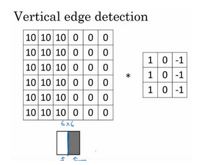

- 水平检测

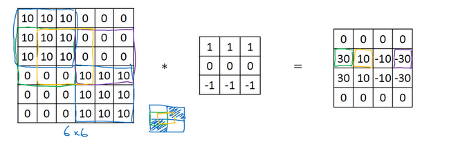

#### Padding

假设输入图片的大小为 n×nn×n，而滤波器的大小为 f×ff×f，则卷积后的输出图片大小为 (n−f+1)×(n−f+1)(n−f+1)×(n−f+1)。

这样就有两个问题：

- 每次卷积运算后，输出图片的尺寸缩小；
- 原始图片的角落、边缘区像素点在输出中采用较少，输出图片丢失边缘位置的很多信息。

为了解决这些问题，可以在进行卷积操作前，对原始图片在边界上进行**填充（Padding）**，以增加矩阵的大小。通常将 0 作为填充值。

设每个方向扩展像素点数量为 pp，则填充后原始图片的大小为 (n+2p)×(n+2p)(n+2p)×(n+2p)，滤波器大小保持 f×ff×f不变，则输出图片大小为 (n+2p−f+1)×(n+2p−f+1)(n+2p−f+1)×(n+2p−f+1)。

因此，在进行卷积运算时，我们有两种选择：

- **Valid 卷积**：不填充，直接卷积。结果大小为 (n−f+1)×(n−f+1)(n−f+1)×(n−f+1)；
- **Same 卷积**：进行填充，并使得卷积后结果大小与输入一致，这样 $p=\frac{f−1}{2}$。

在计算机视觉领域，f通常为奇数。原因包括 Same 卷积中$p=\frac{f−1}{2}$能得到自然数结果，并且滤波器有一个便于表示其所在位置的中心点。

#### 卷积步长

卷积过程中，有时需要通过填充来避免信息损失，有时也需要通过设置**步长（Stride）**来压缩一部分信息。步长表示滤波器在原始图片的水平方向和垂直方向上每次移动的距离。

设步长为 s，填充长度为 p，输入图片大小为 n×n，滤波器大小为 f×f，则卷积后图片的尺寸为：

$$\left\lfloor\frac{n+2 p-f}{s}+1\right\rfloor \times\left\lfloor\frac{n+2 p-f}{s}+1\right\rfloor$$

注意公式中有一个向下取整的符号，用于处理商不为整数的情况。向下取整反映着当取原始矩阵的图示蓝框完全包括在图像内部时，才对它进行运算。

### 高维卷积

如果我们想要对三通道的 RGB 图片进行卷积运算，那么其对应的滤波器组也同样是三通道的。过程是将每个单通道（R，G，B）与对应的滤波器进行卷积运算求和，然后再将三个通道的和相加，将 27 个乘积的和作为输出图片的一个像素值。

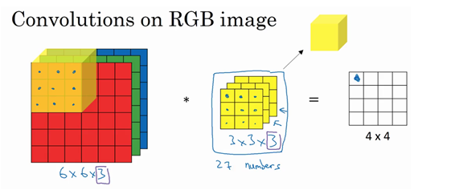

不同通道的滤波器可以不相同。例如只检测 R 通道的垂直边缘，G 通道和 B 通道不进行边缘检测，则 G 通道和 B 通道的滤波器全部置零。**当输入有特定的高、宽和通道数时，滤波器可以有不同的高和宽，但通道数必须和输入一致。**

如果想同时检测垂直和水平边缘，或者更多的边缘检测，可以增加更多的滤波器组。例如设置第一个滤波器组实现垂直边缘检测，第二个滤波器组实现水平边缘检测。设输入图片的尺寸为 n×n×nc（ncnc为通道数），滤波器尺寸为 f×f×nc，则卷积后的输出图片尺寸为 (n−f+1)×(n−f+1)×n′c，n′c为滤波器组的个数。

### 单层卷积网络

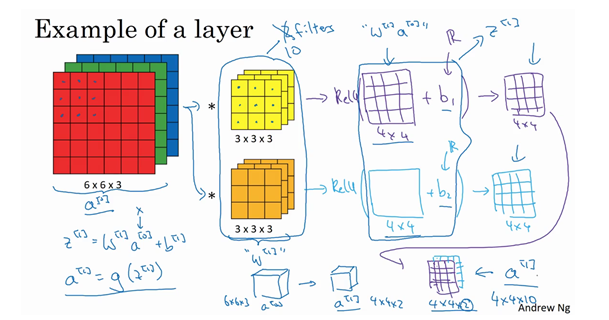

与之前的卷积过程相比较，卷积神经网络的单层结构多了激活函数和偏移量；而与标准神经网络：

$$Z^{[l]}=W^{[l]}A^{[l-1]}+b\\A^{[l]=g^{[l]}(Z^{[l]})}$$

相比，滤波器的数值对应着权重 W<sup>[l]</sup>，卷积运算对应着 W<sup>[l]</sup>与 A[l−1]<sup>[l-1]</sup>的乘积运算，所选的激活函数变为 ReLU。

对于一个 3x3x3 的滤波器，包括偏移量 bb在内共有 28 个参数。不论输入的图片有多大，用这一个滤波器来提取特征时，参数始终都是 28 个，固定不变。即**选定滤波器组后，参数的数目与输入图片的尺寸无关**。因此，卷积神经网络的参数相较于标准神经网络来说要少得多。这是 CNN 的优点之一。

### 简单卷积网络示例

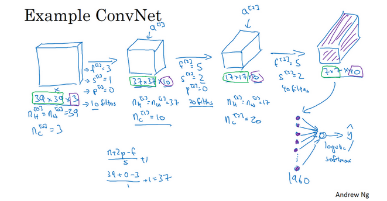

一个典型的卷积神经网络通常包含有三种层：**卷积层（Convolution layer）**、**池化层（Pooling layer）**、**全连接层（Fully Connected layer）**。仅用卷积层也有可能构建出很好的神经网络，但大部分神经网络还是会添加池化层和全连接层，它们更容易设计。

### 池化层

**池化层**的作用是缩减模型的大小，提高计算速度，同时减小噪声提高所提取特征的稳健性。

采用较多的一种池化过程叫做**最大池化（Max Pooling）**。将输入拆分成不同的区域，输出的每个元素都是对应区域中元素的最大值，如下图所示：

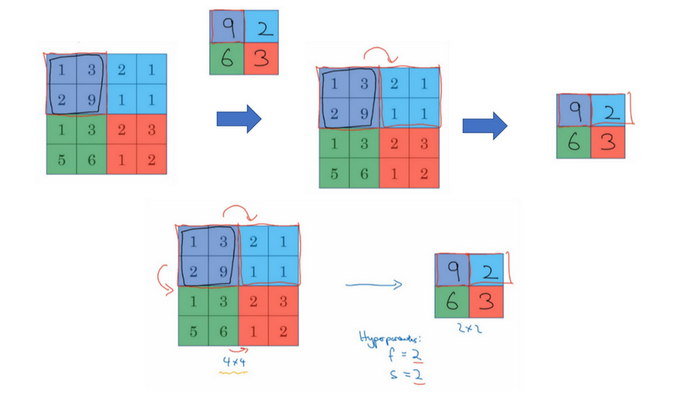

池化过程类似于卷积过程，上图所示的池化过程中相当于使用了一个大小 f=2f=2的滤波器，且池化步长 s=2s=2。卷积过程中的几个计算大小的公式也都适用于池化过程。如果有多个通道，那么就对每个通道分别执行计算过程。

对最大池化的一种直观解释是，元素值较大可能意味着池化过程之前的卷积过程提取到了某些特定的特征，池化过程中的最大化操作使得只要在一个区域内提取到某个特征，它都会保留在最大池化的输出中。但是，没有足够的证据证明这种直观解释的正确性，而最大池化被使用的主要原因是它在很多实验中的效果都很好。

另一种池化过程是**平均池化（Average Pooling）**，就是从取某个区域的最大值改为求这个区域的平均值：

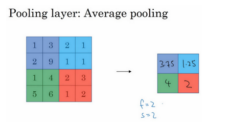

池化过程的特点之一是，它有一组超参数，但是并**没有参数需要学习**。池化过程的超参数包括滤波器的大小 f、步长 s，以及选用最大池化还是平均池化。而填充 pp则很少用到。

池化过程的输入维度为：$n_H\times n_W\times n_c$

输出维度为：

$$\left\lfloor\frac{n_H-f}{s}+1\right\rfloor \times\left\lfloor\frac{n_W-f}{s}+1\right\rfloor\times n_c$$

### 卷积神经网络示例

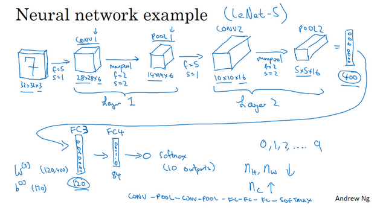

在计算神经网络的层数时，通常只统计具有权重和参数的层，因此池化层通常和之前的卷积层共同计为一层。

图中的 FC3 和 FC4 为全连接层，与标准的神经网络结构一致。整个神经网络各层的尺寸与参数如下表所示：

|                     | Activation shape | Activation Size | \#parameters |
| ------------------- | ---------------- | --------------- | ------------ |
| **Input:**          | (32, 32, 3)      | 3072            | 0            |
| **CONV1(f=5, s=1)** | (28, 28, 6)      | 4704            | 158          |
| **POOL1**           | (14, 14, 6)      | 1176            | 0            |
| **CONV2(f=5, s=1)** | (10, 10, 16)     | 1600            | 416          |
| **POOL2**           | (5, 5, 16)       | 400             | 0            |
| **FC3**             | (120, 1)         | 120             | 48001        |
| **FC4**             | (84, 1)          | 84              | 10081        |
| **Softmax**         | (10, 1)          | 10              | 841          |

**为什么使用卷积？**

相比标准神经网络，对于大量的输入数据，卷积过程有效地减少了 CNN 的参数数量，原因有以下两点：

- **参数共享（Parameter sharing）**：特征检测如果适用于图片的某个区域，那么它也可能适用于图片的其他区域。即在卷积过程中，不管输入有多大，一个特征探测器（滤波器）就能对整个输入的某一特征进行探测。
- **稀疏连接（Sparsity of connections）**：在每一层中，由于滤波器的尺寸限制，输入和输出之间的连接是稀疏的，每个输出值只取决于输入在局部的一小部分值。

池化过程则在卷积后很好地聚合了特征，通过降维来减少运算量。

由于 CNN 参数数量较小，所需的训练样本就相对较少，因此在一定程度上不容易发生过拟合现象。并且 CNN 比较擅长捕捉区域位置偏移。即进行物体检测时，不太受物体在图片中位置的影响，增加检测的准确性和系统的健壮性。

### 经典卷积网络

#### LeNet-5

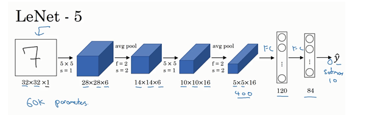

特点：

- LeNet-5 针对灰度图像而训练，因此输入图片的通道数为 1。
- 该模型总共包含了约 6 万个参数，远少于标准神经网络所需。
- 典型的 LeNet-5 结构包含卷积层（CONV layer），池化层（POOL layer）和全连接层（FC layer），排列顺序一般为 CONV layer->POOL layer->CONV layer->POOL layer->FC layer->FC layer->OUTPUT layer。一个或多个卷积层后面跟着一个池化层的模式至今仍十分常用。
- 当 LeNet-5模型被提出时，其池化层使用的是平均池化，而且各层激活函数一般选用 Sigmoid 和 tanh。现在，我们可以根据需要，做出改进，使用最大池化并选用 ReLU 作为激活函数。

相关论文：[LeCun et.al., 1998. Gradient-based learning applied to document recognition](http://ieeexplore.ieee.org/stamp/stamp.jsp?arnumber=726791&tag=1)。吴恩达老师建议精读第二段，泛读第三段。

#### **AlexNet**

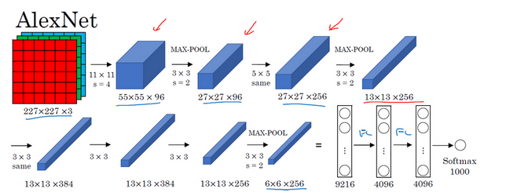

特点：

- AlexNet 模型与 LeNet-5 模型类似，但是更复杂，包含约 6000 万个参数。另外，AlexNet 模型使用了 ReLU 函数。
- 当用于训练图像和数据集时，AlexNet 能够处理非常相似的基本构造模块，这些模块往往包含大量的隐藏单元或数据。

相关论文：[Krizhevsky et al.,2012. ImageNet classification with deep convolutional neural networks](http://papers.nips.cc/paper/4824-imagenet-classification-with-deep-convolutional-neural-networks.pdf)。这是一篇易于理解并且影响巨大的论文，计算机视觉群体自此开始重视深度学习。

#### VGG-16 

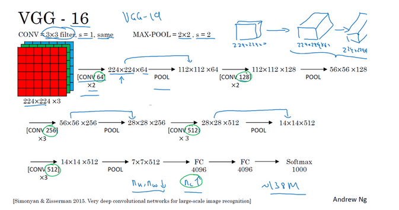

特点：

- VGG 又称 VGG-16 网络，“16”指网络中包含 16 个卷积层和全连接层。
- 超参数较少，只需要专注于构建卷积层。
- 结构不复杂且规整，在每一组卷积层进行滤波器翻倍操作。
- VGG 需要训练的特征数量巨大，包含多达约 1.38 亿个参数。

相关论文：[Simonvan & Zisserman 2015. Very deep convolutional networks for large-scale image recognition](https://arxiv.org/pdf/1409.1556.pdf)。

### 残差网络(ResNets)

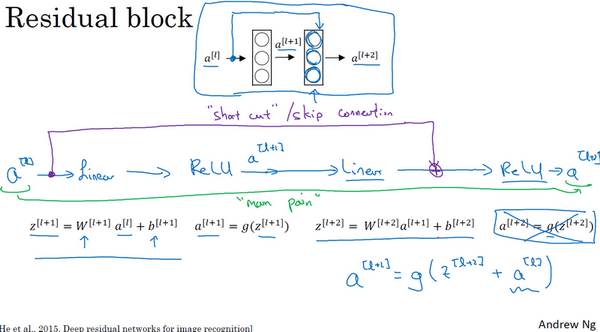

上图的结构被称为**残差块（Residual block）**。通过**捷径（Short cut，或者称跳远连接，Skip connections）**可以将 a[l]添加到第二个 ReLU 过程中，直接建立 a[l]与 a[l+2]之间的隔层联系。表达式如下：

$$Z^{[l+1]}=W^{[l+1]} a^{[l]}+b^{[l+1]}\\a^{[l+1]}=g(z^{[l+1]})\\Z^{[l+2]}=W^{[l+2]} a^{[l+1]}+b^{[l+2]}\\a^{[l+2]}=g(z^{[l+2]})$$

构建一个残差网络就是将许多残差块堆积在一起，形成一个深度网络。

为了便于区分，在 ResNets 的论文[He et al., 2015. Deep residual networks for image recognition](https://arxiv.org/pdf/1512.03385.pdf)中，非残差网络被称为**普通网络（Plain Network）**。将它变为残差网络的方法是加上所有的跳远连接。

在理论上，随着网络深度的增加，性能应该越来越好。但实际上，对于一个普通网络，随着神经网络层数增加，训练错误会先减少，然后开始增多。但残差网络的训练效果显示，即使网络再深，其在训练集上的表现也会越来越好。

### 1×1 卷积

1x1 卷积（1x1 convolution，或称为 Network in Network）指滤波器的尺寸为 1。当通道数为 1 时，1x1 卷积意味着卷积操作等同于乘积操作。

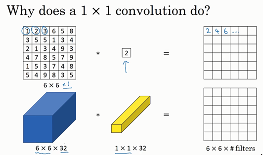

而当通道数更多时，1x1 卷积的作用实际上类似全连接层的神经网络结构，从而降低（或升高，取决于滤波器组数）数据的维度。

虽然论文[Lin et al., 2013. Network in network](https://arxiv.org/pdf/1312.4400.pdf)中关于架构的详细内容并没有得到广泛应用，但是 1x1 卷积的理念十分有影响力，许多神经网络架构（包括 Inception 网络）都受到它的影响。

###  Inception 网络

在之前的卷积网络中，我们只能选择单一尺寸和类型的滤波器。而 **Inception 网络的作用**即是代替人工来确定卷积层中的滤波器尺寸与类型，或者确定是否需要创建卷积层或池化层。


如图，Inception 网络选用不同尺寸的滤波器进行 Same 卷积，并将卷积和池化得到的输出组合拼接起来，最终让网络自己去学习需要的参数和采用的滤波器组合。

相关论文：[Szegedy et al., 2014, Going Deeper with Convolutions](https://arxiv.org/pdf/1409.4842.pdf)

### Inception 模块


上图是引入 1x1 卷积后的 Inception 模块。值得注意的是，为了将所有的输出组合起来，红色的池化层使用 Same 类型的填充（padding）来池化使得输出的宽高不变，通道数也不变。

多个 Inception 模块组成一个完整的 Inception 网络（被称为 GoogLeNet，以向 LeNet 致敬），如下图所示：


注意黑色椭圆圈出的隐藏层，这些分支都是 Softmax 的输出层，可以用来参与特征的计算及结果预测，起到调整并防止发生过拟合的效果。

经过研究者们的不断发展，Inception 模型的 V2、V3、V4 以及引入残差网络的版本被提出，这些变体都基于 Inception V1 版本的基础思想上。顺便一提，Inception 模型的名字来自电影《盗梦空间》。

### 目标检测

### 目标定位

定位分类问题不仅要求判断出图片中物体的种类，还要在图片中标记出它的具体位置，用**边框（Bounding Box，或者称包围盒）**把物体圈起来。一般来说，定位分类问题通常只有一个较大的对象位于图片中间位置；而在目标检测问题中，图片可以含有多个对象，甚至单张图片中会有多个不同分类的对象。

为了定位图片中汽车的位置，可以让神经网络多输出 4 个数字，标记为$b_x$、$b_y$、$b_h$、$b_w$。将图片左上角标记为 (0, 0)，右下角标记为 (1, 1)，则有：

- 红色方框的中心点：($b_x$，$b_y$)
- 边界框的高度：$b_h$
- 边界框的宽度：$b_w$

因此，训练集不仅包含对象分类标签，还包含表示边界框的四个数字。定义目标标签 Y 如下：

$$\left[\begin{array}{l}
P_{c} \\
b_{x} \\
b_{y} \\
b_{h} \\
b_{w} \\
c_{1} \\
c_{2} \\
c_{3}
\end{array}\right]$$

其中，$c_n$表示存在第 n个种类的概率；如果 $P_c=0$，表示没有检测到目标，则输出标签后面的 7 个参数都是无效的，可以忽略（用 ? 来表示）。

损失函数可以表示为 $L(\hat{y}, y)$，如果使用平方误差形式，对于不同的  $P_c$有不同的损失函数（注意下标 i指标签的第 i个值）：

1. $P_c=1$，即$y_1=1$：

   $$L(\hat{y}, y)=\left(\hat{y}_{1}-y_{1}\right)^{2}+\left(\hat{y}_{2}-y_{2}\right)^{2}+\cdots+\left(\hat{y}_{8}-y_{8}\right)^{2}$$

2. $P_c=0$，即$y_1=0$：

   $$L(\hat{y}, y)=\left(\hat{y}_{1}-y_{1}\right)^{2}$$

除了使用平方误差，也可以使用逻辑回归损失函数，类标签 $c_{1}$,$c_{2}$,$c_{3}$ 也可以通过 softmax 输出。相比较而言，平方误差已经能够取得比较好的效果。

### 基于滑动窗口的目标检测

想要实现目标检测，可以采用**基于滑动窗口的目标检测（Sliding Windows Detection）**算法。该算法的步骤如下：

1. 训练集上搜集相应的各种目标图片和非目标图片，样本图片要求尺寸较小，相应目标居于图片中心位置并基本占据整张图片。
2. 使用训练集构建 CNN 模型，使得模型有较高的识别率。
3. 选择大小适宜的窗口与合适的固定步幅，对测试图片进行从左到右、从上倒下的滑动遍历。每个窗口区域使用已经训练好的 CNN 模型进行识别判断。
4. 可以选择更大的窗口，然后重复第三步的操作。


滑动窗口目标检测的**优点**是原理简单，且不需要人为选定目标区域；**缺点**是需要人为直观设定滑动窗口的大小和步幅。滑动窗口过小或过大，步幅过大均会降低目标检测的正确率。另外，每次滑动都要进行一次 CNN 网络计算，如果滑动窗口和步幅较小，计算成本往往很大。

所以，滑动窗口目标检测算法虽然简单，但是性能不佳，效率较低。

### 滑动窗口的卷积实现

相比从较大图片多次截取，在卷积层上应用滑动窗口目标检测算法可以提高运行速度。所要做的仅是将全连接层换成卷积层，即使用与上一层尺寸一致的滤波器进行卷积运算。


如图，对于 16x16x3 的图片，步长为 2，CNN 网络得到的输出层为 2x2x4。其中，2x2 表示共有 4 个窗口结果。对于更复杂的 28x28x3 的图片，得到的输出层为 8x8x4，共 64 个窗口结果。最大池化层的宽高和步长相等。

运行速度提高的原理：在滑动窗口的过程中，需要重复进行 CNN 正向计算。因此，不需要将输入图片分割成多个子集，分别执行向前传播，而是将它们作为一张图片输入给卷积网络进行一次 CNN 正向计算。这样，公共区域的计算可以共享，以降低运算成本。

相关论文：[Sermanet et al., 2014. OverFeat: Integrated Recognition, Localization and Detection using Convolutional Networks](https://arxiv.org/pdf/1312.6229.pdf)

### **YOLO算法**

在上述算法中，边框的位置可能无法完美覆盖目标，或者大小不合适，或者最准确的边框并非正方形，而是长方形。

**YOLO（You Only Look Once）算法**可以用于得到更精确的边框。YOLO 算法将原始图片划分为 n×n 网格，并将[目标定位](http://kyonhuang.top/Andrew-Ng-Deep-Learning-notes/#/Convolutional_Neural_Networks/目标检测?id=目标定位)一节中提到的图像分类和目标定位算法，逐一应用在每个网格中，每个网格都有标签如：

$$\left[\begin{array}{l}
P_{c} \\
b_{x} \\
b_{y} \\
b_{h} \\
b_{w} \\
c_{1} \\
c_{2} \\
c_{3}
\end{array}\right]$$

若某个目标的中点落在某个网格，则该网格负责检测该对象。

YOLO 算法的优点：

1. 和图像分类和目标定位算法类似，显式输出边框坐标和大小，不会受到滑窗分类器的步长大小限制。
2. 仍然只进行一次 CNN 正向计算，效率很高，甚至可以达到实时识别。

相关论文：[Redmon et al., 2015. You Only Look Once: Unified, Real-Time Object Detection](https://arxiv.org/pdf/1506.02640.pdf)。Ng 认为该论文较难理解。

### 交并比

**交并比（IoU, Intersection Over Union）**函数用于评价对象检测算法，它计算预测边框和实际边框交集（I）与并集（U）之比：

$IoU=\frac{I}{U}$

IoU 的值在 0～1 之间，且越接近 1 表示目标的定位越准确。IoU 大于等于 0.5 时，一般可以认为预测边框是正确的，当然也可以更加严格地要求一个更高的阈值。

### 非极大值抑制

YOLO 算法中，可能有很多网格检测到同一目标。**非极大值抑制（Non-max Suppression）**会通过清理检测结果，找到每个目标中点所位于的网格，确保算法对每个目标只检测一次。

进行非极大值抑制的步骤如下：

1. 将包含目标中心坐标的可信度$P_c$小于阈值（例如 0.6）的网格丢弃；
2. 选取拥有最大 $P_c$的网格；
3. 分别计算该网格和其他所有网格的 IoU，将 IoU 超过预设阈值的网格丢弃；
4. 重复第 2~3 步，直到不存在未处理的网格。

上述步骤适用于单类别目标检测。进行多个类别目标检测时，对于每个类别，应该单独做一次非极大值抑制。

### Anchor Boxes

到目前为止，我们讨论的情况都是一个网格只检测一个对象。如果要将算法运用在多目标检测上，需要用到 Anchor Boxes。一个网格的标签中将包含多个 Anchor Box，相当于存在多个用以标识不同目标的边框。


在上图示例中，我们希望同时检测人和汽车。因此，每个网格的的标签中含有两个 Anchor Box。输出的标签结果大小从 3×3×8 变为 3×3×16。若两个  $P_c$都大于预设阈值，则说明检测到了两个目标。

在单目标检测中，图像中的目标被分配给了包含该目标中点的那个网格；引入 Anchor Box 进行多目标检测时，图像中的目标则被分配到了包含该目标中点的那个网格以及具有最高 IoU 值的该网格的 Anchor Box。

Anchor Boxes 也有局限性，对于同一网格有三个及以上目标，或者两个目标的 Anchor Box 高度重合的情况处理不好。

Anchor Box 的形状一般通过人工选取。高级一点的方法是用 k-means 将两类对象形状聚类，选择最具代表性的 Anchor Box。

### **R-CNN**

前面介绍的滑动窗口目标检测算法对一些明显没有目标的区域也进行了扫描，这降低了算法的运行效率。为了解决这个问题，**R-CNN（Region CNN，带区域的 CNN）**被提出。通过对输入图片运行**图像分割算法**，在不同的色块上找出**候选区域（Region Proposal）**，就只需要在这些区域上运行分类器。


R-CNN 的缺点是运行速度很慢，所以有一系列后续研究工作改进。例如 Fast R-CNN（与基于卷积的滑动窗口实现相似，但得到候选区域的聚类步骤依然很慢）、Faster R-CNN（使用卷积对图片进行分割）。不过大多数时候还是比 YOLO 算法慢。

相关论文：

- R-CNN：[Girshik et al., 2013. Rich feature hierarchies for accurate object detection and semantic segmentation](https://arxiv.org/pdf/1311.2524.pdf)
- Fast R-CNN：[Girshik, 2015. Fast R-CNN](https://arxiv.org/pdf/1504.08083.pdf)
- Faster R-CNN：[Ren et al., 2016. Faster R-CNN: Towards real-time object detection with region proposal networks](https://arxiv.org/pdf/1506.01497v3.pdf)